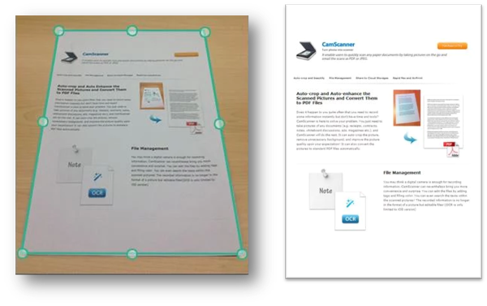
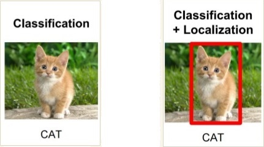
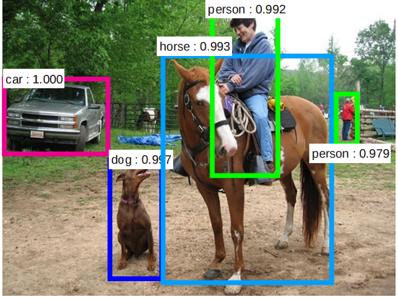

# Introduction to Computer Vision (CV)
Authors: [Nguyen Quoc Bao](https://github.com/bqnguyen94)

* [What is CV](#what-is-cv)
   * [Applications of CV](#applications-of-cv)
   * [Typical CV tasks](#typical-cv-tasks)
* [Core problems in CV](#core-problems-in-cv)
   * [Image Transformation](#image-filtering)
   * [Image Classification](#image-transformation)
   * [Object Detection](#object-detection)
   * [Object Tracking](#object-tracking)

## What is CV
Computer vision (CV) is a field of study of computer science concerning with the theories and technologies in building computer systems that can derive useful information from visual data. CV is a prominent field of study nowadays as it allows computers to autonomously solve problems that otherwise require human sight.

In computer vision, an image is represented as a number matrix, or a set of matrices, with each number in the matrix corresponds to the color value or intensity value of a pixel in the image. With this representation, linear algebra can be exploited for many CV operations from the most basic like transformation to very complex like feature extraction and motion tracking.

Additionally, with deep learning, a lot of new applications of computer vision have been introduced, including facial recognition, and object detection that is widely used in self-driving cars.

### Applications of CV
Many systems and applications rely on computer vision, as they work extensively with image and video input for:

- Navigation, e.g. autonomous cars to keep track of the road, detect pedestrians, and avoid collision with other vehicles.
- Facial Detection, e.g. smartphones' camera software to focus on faces.
- Visual Surveillance, e.g. detecting movements in security footage.
- Automatic Inspection, e.g. measuring structures, modelling environment.
- Searching, e.g. image search engines.

### Typical CV tasks
For a typical computer vision system, the tasks it aims to perform may include, but are not limited to, the following:

- Geometric Image Transformation
- Image Filtering
- Image Classification
- Structural Analysis and Shape Descripting
- Feature Detection
- Object Detection
- Object Localization
- Object Tracking

## Core problems in CV
In practice, there are many software libraries and frameworks providing Computer Vision functions such as OpenCV, MATLAB, dlib, etc. In the following sections, examples will be given using OpenCV's Python APIs; therefore, it is necessary to establish some basic understandings of OpenCV's data structure - Matrix. OpenCV treats an image as a matrix, each value in the matrix corresponds to a pixel in the image, representing its color in either the RGB color space, or the HSV color space.

### Image Transformation

In many applications, image transformation is often the first step that standardizes the input and allows the application to subsequently perform more complex analysis.

*[source](https://www.camscanner.com/)*

### Image Classification

Image classification refers to the task of identifying the object present in an image. Typically, a predetermined set of possible objects is given and the classification of the image is the object that is most likely to exist in it.

*[source](http://cs231n.github.io/classification/)*

Image classification is often paired with object localization, which is the task of finding where in the image the object is. Many more complex problems in Computer Vision, such as object detection and segmentation, can be reduced to image classification and localization.

*[source](http://cs231n.github.io/classification/)*

### Object Detection

Object detection, as the name suggests, detects objects within an image. It combines image classification and localization in a sense that it gives the classification and bounding box (localization) of object in an image, but it does this to all instance of every known type of objects found in the image, instead of assuming only one type is present.

*[source](https://github.com/tensorflow/models/tree/master/research/object_detection)*

### Object Tracking

Object tracking is the process of following and establishing the movement of a specific object of interest in a sequential set of images - typically a video clip or a real-time camera feed.

*[Tracking movement of cars with OpenCV](https://docs.opencv.org/3.3.1/)*

### GPU-accelerated Computer Vision
