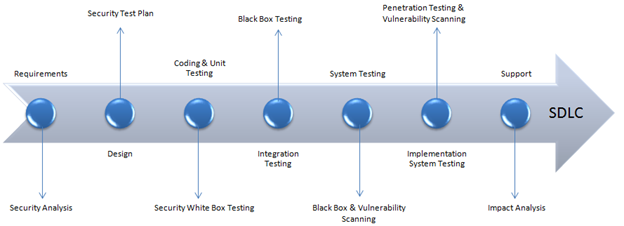
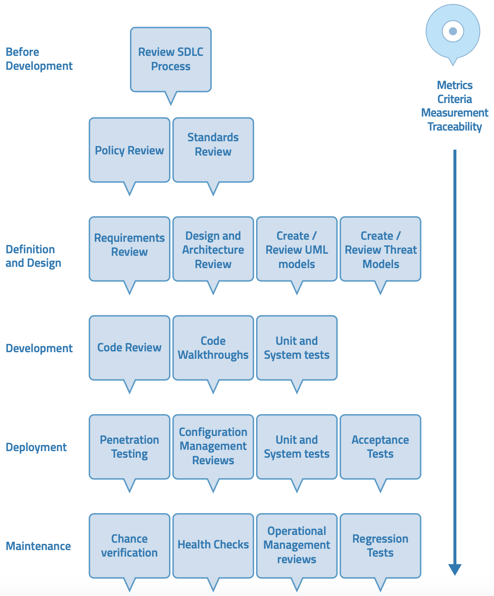

<frontmatter>
  title: Introduction to Security Testing
  header: pagetop.md
  footer: footer.md
  head: head.md
  siteNav: mainNav.md
  pageNav: 3
</frontmatter>

{{ booktitle | safe }}

# Introduction to Security Testing

**Author(s): [Ahmed Bahajjaj](https://github.com/madanalogy)** 
Reviewers: [Pending](https://github.com/teammates)

<box id="article-toc">

* [Introduction to Security Testing](#introduction-to-security-testing)
    * [What Is Security Testing?‎](#what-is-security-testing)
    * [Why Have Security Testing?](#why-have-security-testing)
    * [How to Get Started with Security Testing?](#how-to-get-started-with-security-testing)
        * [Phase 1: Before Development Begins](#phase-1-before-development-begins)
        * [Phase 2: During Definition and Design](#phase-2-during-definition-and-design)
        * [Phase 3: During Development](#phase-3-during-development)‎
        * [Phase 4: During Deployment‎](#phase-4-during-deployment)
        * [Phase 5: Maintenance and Operations](#phase-5-maintenance-and-operations)
    * [Additional Resources‎](#additional-resources)
</box>

## What Is Security Testing?

Security Testing is **a type of Software Testing** that uncovers vulnerabilities, threats, risks in a software application and prevents malicious attacks from intruders. The purpose of Security Tests is to identify all possible loopholes and weaknesses of the software system which might result in a loss of information, revenue, repute at the hands of the employees or outsiders of the Organization.

The goal of security testing is to:
- Identify the threats in the system.
- To measure the potential vulnerabilities of the system.
- To help in detecting every possible security risks in the system.
- To help developers in fixing the security problems through coding.

:fas-info-circle: Knowledge of Software Development Life-Cycles (SDLCs) would be useful but not necessary.

## Why Have Security Testing?

A comprehensive security testing framework deals with validation across all layers of an application. Through this, the organization can evaluate their application code for vulnerabilities and take remedial measures for the same. Recently, many of the software development organizations have been making use of secure software development life cycle methodologies to ensure identification and rectification of vulnerability areas early on in the application development process.

__Security Testing helps to achieve__:
- Confidentiality of Information.
- Integrity of Information.
- Authenticity of Identity.
- Authorisation: The process of determining that a requester is allowed to receive a service or perform an operation (e.g. Access Control).
- Availability: Assuring information and communications services will be ready for use when expected.
- Non-Repudiation: In reference to digital security, non-repudiation means to ensure that a transferred message has been sent and received by the parties claiming to have sent and received the message.

## How to Get Started with Security Testing?

As a subset of software testing, security testing operates in tandem with your SDLC. It is a conscious decision that needs to be made for effective application.

### Phase 1: Before Development Begins

Define an SDLC and review policy standards. Ensure that there are appropriate policies, standards, and documentation in place. Documentation is extremely important as it gives development teams guidelines and policies that they can follow. **People can only do the right thing if they know what the right thing is.**

### Phase 2: During Definition and Design

Review security requirements, always make sure you have a security policy! Security requirements define how an application works from a security perspective. It is essential that the security requirements are tested. Testing in this case means testing the assumptions that are made in the requirements and testing to see if there are gaps in the requirements definitions.

### Phase 3: During Development

Theoretically, development is the implementation of a design. However, in the real world, many design decisions are made during code development. These are often smaller decisions that were either too detailed to be described in the design, or issues where no policy or standard guidance was offered. If the design and architecture were not adequate, the developer will be faced with many decisions. If there were insufficient policies and standards, the developer will be faced with even more decisions.

### Phase 4: During Deployment‎

Perform a penetration test of your application. Having tested the requirements, analyzed the design, and performed code review, it might be assumed that all issues have been caught. Hopefully this is the case, but penetration testing the application after it has been deployed provides a last check to ensure that nothing has been missed.

### Phase 5: Maintenance and Operations

Conduct periodic health checks and ensure change verification. After every change has been approved and tested in the QA environment and deployed into the production environment, it is vital that the change is checked to ensure that the level of security has not been affected by the change. This should be integrated into the change management process.

## Additional Resources

- [OWASP Testing Guide](https://www.owasp.org/images/1/19/OTGv4.pdf) - An extremely comprehensive guide from the Open Web Application Security Project (OWASP) on security testing with in-depth coverage of web-application security testing.
- [Overview by Guru99.com](https://www.guru99.com/what-is-security-testing.html) - A very brief overarching summary of Security Testing and it's role in Software Testing.
- [Breakdown by SoftwareTestingHelp.com](https://www.softwaretestinghelp.com/how-to-test-application-security-web-and-desktop-application-security-testing-techniques/) - Breakdown of security testing into common attack vectors and recommended tools.

